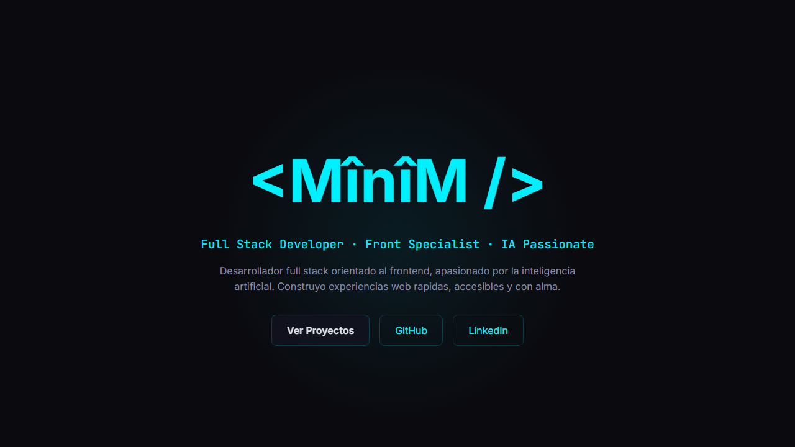
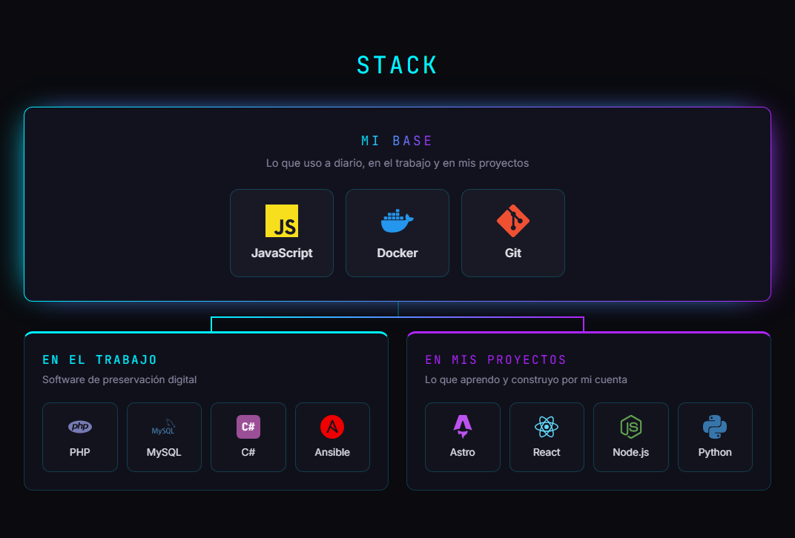
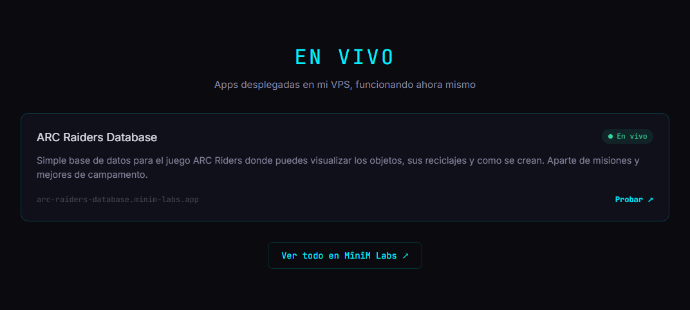
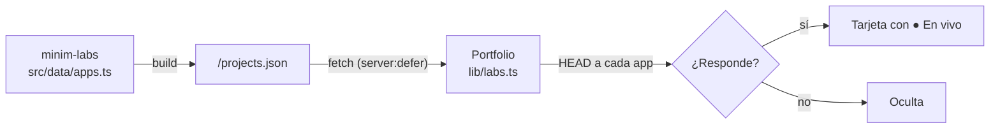

<div align="center">

# &lt;MînîM /&gt;

**Portfolio personal · Full Stack Developer · Front Specialist · IA Passionate**

Hecho con Astro, sin frameworks de UI y configurable al 100 % desde JSON.

[](https://astro.build)
[](https://www.typescriptlang.org)
[](https://nodejs.org)
[](Dockerfile)

[**MînîM Labs**](https://minim-labs.app) · [GitHub](https://github.com/minimorcy) · [LinkedIn](https://www.linkedin.com/in/javier-morcillo-nuevo/)

 en cian sobre fondo oscuro" width="820">

</div>

---

## La idea

La mayoría de portfolios son un muro de iconos y una lista de repos. Este intenta contar algo más:

- **Qué uso y dónde.** Mi stack del trabajo y el de mis proyectos personales son distintos, así que el portfolio lo enseña tal cual: una base común que se bifurca en dos caminos.
- **Qué está funcionando ahora mismo.** Las apps que tengo desplegadas en mi VPS aparecen solas, y solo si responden de verdad.
- **Lo que no está en GitHub.** Mis mejores proyectos son privados, así que se cuentan como casos de estudio en lugar de depender de repos públicos.

## Lo que hay dentro

### Stack con contexto

Una base compartida (lo que uso a diario en todas partes) que se divide en **trabajo** y **proyectos propios**. Cada tecnología se declara una vez con su contexto y el componente decide dónde va.

<div align="center">

</div>

```json
{ "name": "Docker", "icon": "docker", "color": "#2496ED", "context": ["work", "personal"] }
```

### Apps en vivo desde MînîM Labs

[MînîM Labs](https://minim-labs.app) es el hub donde viven mis apps desplegadas. Publica un `projects.json` y el portfolio lo consume en el servidor:

<div align="center">

</div>



- **Una sola fuente de verdad:** añado una app al hub y aparece en los dos sitios.
- **Health check real:** cada app se comprueba con timeout de 3 s; si no responde, no se enseña.
- **Nunca rompe la página:** el componente va con `server:defer`, cachea 5 minutos (también los fallos) y, si el hub no está disponible, la sección simplemente no aparece.
- **Diagnosticable:** cualquier fallo deja una línea `[labs]` en los logs con el motivo.

### Proyectos destacados

Casos de estudio escritos a mano en `featured-projects.json`, con captura, stack, enlaces y un distintivo de **código privado**. La sección no aparece mientras esté vacía.

### Contenido en JSON

Textos, stack, proyectos y filtros de GitHub viven en `src/config/`. Cambiar el contenido nunca obliga a tocar un componente.

| Archivo | Qué controla |
|---|---|
| `site.json` | Todos los textos, enlaces, SEO e interruptores de secciones |
| `tech-stack.json` | Tecnologías y su contexto (trabajo / personal / ambos) |
| `featured-projects.json` | Casos de estudio, públicos o privados |
| `repos-config.json` | Filtros y orden de los repos de GitHub |

Referencia completa de campos en [docs/CONFIGURATION.md](docs/CONFIGURATION.md).

## Detalles técnicos

- **Astro 5 con salida estática + islas de servidor.** La página es estática; solo las secciones que dependen de datos externos (MînîM Labs, GitHub) se renderizan en el servidor con `server:defer`, así que no bloquean la carga.
- **Sin frameworks de UI en el cliente.** Todo es HTML y CSS con scope por componente; el único JavaScript es el pequeño cargador inline de las islas de servidor.
- **Tipos estrictos** para toda la configuración (`src/types/index.ts`) y validación defensiva de los datos externos.
- **Secretos seguros:** `GITHUB_TOKEN` se declara con `astro:env` como secreto de servidor; nunca llega al cliente.
- **Accesibilidad:** enlace "saltar al contenido", `aria-label` en los iconos y respeto a `prefers-reduced-motion` en todas las animaciones.
- **Diseño "Dark Tech with AI Soul":** fondo oscuro, acentos cian y violeta, glassmorphism y un glitch en el nombre.

## Estructura

```
src/
├── components/     Hero, TechStack, FeaturedProjects, LabsApps, GitHubRepos, Footer
├── config/         Todo el contenido editable (JSON)
├── lib/            github.ts y labs.ts: datos externos con caché y timeouts
├── layouts/        Layout base con SEO y Open Graph
├── pages/          index.astro
├── styles/         Tokens de diseño y utilidades globales
└── types/          Tipos de la configuración y de los datos externos
```

## Arrancarlo en local

Requiere **Node 24** (hay un `.nvmrc`).

```bash
git clone https://github.com/minimorcy/minim-portfolio.git
cd minim-portfolio
npm install
cp .env.example .env   # añade tu GITHUB_TOKEN (ver docs/PAT-GUIDE.md)
npm run dev            # http://localhost:4321
```

| Comando | Qué hace |
|---|---|
| `npm run dev` | Servidor de desarrollo |
| `npm run build` | Build de producción en `dist/` |
| `npm start` | Sirve el build (`node ./dist/server/entry.mjs`) |
| `npx astro check` | Comprobación de tipos |

## Despliegue

Se despliega en un VPS propio con **Coolify** usando el `Dockerfile` multi-stage del repo:

- **Build Pack:** `Dockerfile` (no Nixpacks ni "static site")
- **Puerto:** `4321`
- **Variable de entorno:** `GITHUB_TOKEN`

> Si la sección "En vivo" no aparece en producción, busca `[labs]` en los logs. Un `ENOTFOUND` significa que el DNS del VPS no resuelve el hub: configura DNS públicos en `systemd-resolved`.

También hay una guía para CapRover en [docs/DEPLOYMENT.md](docs/DEPLOYMENT.md).

---

<div align="center">
<sub>Hecho por <a href="https://github.com/minimorcy">MînîM</a> · parte de <a href="https://minim-labs.app">MînîM Labs</a></sub>
</div>
